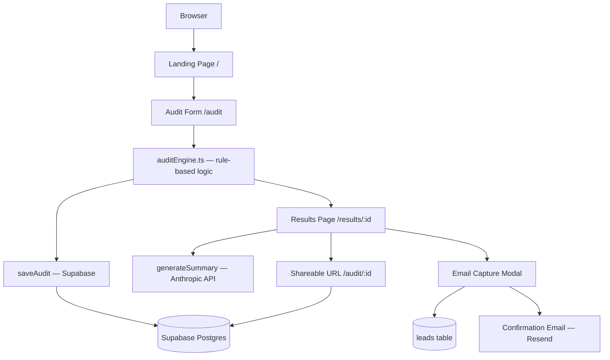

# Architecture

## System diagram

## Data flow

1. User fills spend form → saved in localStorage (no server call)
2. Step 3 submit → auditEngine.ts runs locally — pure TypeScript, zero API calls
3. Result passed to saveAudit() → POST to Supabase audits table → returns UUID
4. UUID stored in sessionStorage + navigate to /results/:uuid
5. Results page reads sessionStorage (instant) or fetches Supabase (shared link)
6. generateSummary() calls Anthropic API with audit data → 100-word paragraph
7. On API failure → fallback template renders silently, no error shown to user
8. Email capture → saveLead() → Supabase leads table → confirmation email via Resend
9. Share URL is /audit/:uuid — reads from Supabase, PII fields never selected

## Stack choices

- React + TypeScript + Vite — Fast iteration, strong types for audit logic, no SSR needed
- Tailwind + shadcn/ui — Consistent design system without custom CSS overhead
- Supabase — Postgres + free tier generous enough for this use case
- Anthropic API — Used only for the narrative summary, not for audit math
- Vercel — Zero-config deploys, edge functions available for future server-side needs

## Why not Next.js

No SSR required for this SPA. Vite cold starts in under 300ms vs Next.js 2-3s during development. For a 7-day build, iteration speed matters more than SSR capabilities.

## Scaling to 10,000 audits per day

- Move audit engine to Vercel Edge Functions (currently client-side — fine for MVP)
- Add Redis caching for Anthropic summaries — same tool stack produces identical summaries
- Rate limit at edge via Vercel middleware, not application layer
- Add Upstash QStash queue for email sending to avoid Resend rate limits
- Supabase Pro plan ($25/mo) handles this load comfortably
- Add a CDN layer for the shared audit pages — they are read-heavy and cacheable
