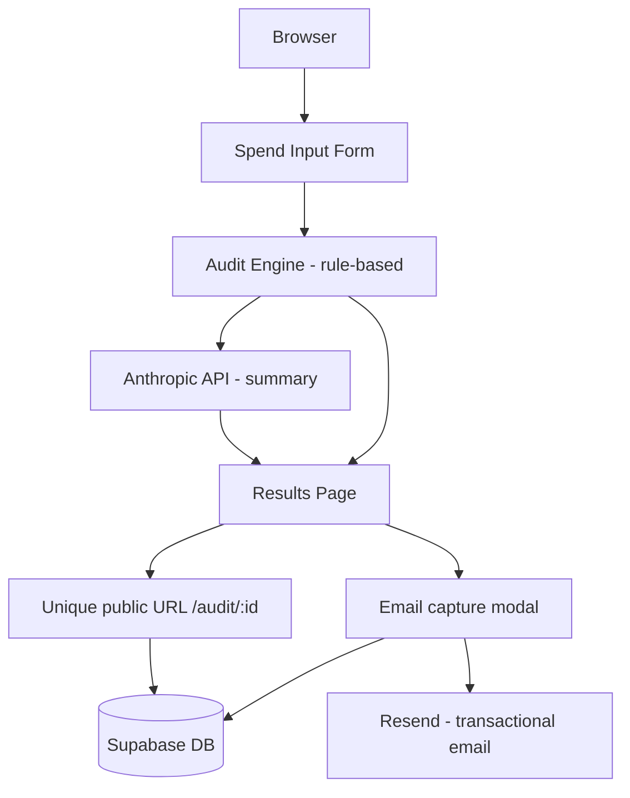

# Architecture

## System diagram

## Data flow

1. User fills the spend form → stored in `localStorage` (no server call yet)
2. On submit → `auditEngine.ts` runs locally, pure TypeScript, zero API calls
3. After engine produces results → `POST /api/audits` saves audit to Supabase, 
   returns a UUID
4. Page navigates to `/results/:uuid`
5. On results page → `POST /api/summary` calls Anthropic API with audit data, 
   returns ~100-word paragraph. On failure → fallback template renders instead
6. User submits email → `POST /api/leads` saves to `leads` table, 
   triggers Resend confirmation email
7. Share URL is `/audit/:uuid` — reads from Supabase, PII fields excluded

## Stack choices

- **React + TypeScript + Vite** — Fast iteration, strong types for audit logic
- **Tailwind + shadcn/ui** — Consistent design system without custom CSS overhead
- **Supabase** — Postgres + auth + realtime in one free-tier service
- **Resend** — Simple transactional email, 100 emails/day free tier
- **Vercel** — Zero-config deploys, edge functions for API routes

## Scaling to 10k audits/day

- Move audit engine to a serverless edge function (currently client-side)
- Add Redis caching for Anthropic summaries — same tool stack = same summary
- Rate limit by IP at the edge, not application layer
- Add a queue (Upstash QStash) for email sending to avoid Resend rate limits
- Supabase scales to this load on the Pro plan ($25/mo)